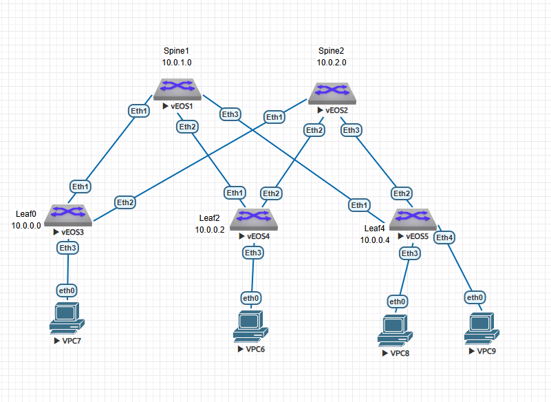

#  Построение Underlay сети(OSPF)
### Топология


###  Цель

  1. Настроить OSPF для Underlay сети
  
  
  
  Условия задания:
  - Настроить OSPF в Underlay сети для IP связнности между всеми сетевыми устройствами.
  - Зафиксировать в документации  план работы, адресное пространство, схему сети, конфигурацию устройств
  - Убедиться в наличии IP связанности между устройствами в OSFP домене
  

#### Часть 1.

Таблица адресации не претерпела изменений с прошлой лабораторной работы, повторю для удобства. Также я нанесла адреса устройств Loopback0 на схему.

 Таблица адресации

|Локация| Устройство     | Интерфейс    | IP-адрес             | Маска подсети|
|:-----------------|:---------------|-------------------------:|:--------------------|-------:|
| DC1  | spine1 | Loopback0   | 10.0.1.0 |255.255.255.255|  
| DC1  | spine1 | Loopback1   | 10.1.1.0 |255.255.255.255|
| DC1  | spine1 | e1   | 10.2.1.1 |255.255.255.254| 
| DC1  | spine1 | e2   | 10.2.1.3 |255.255.255.254| 
| DC1  | spine1 | e3   | 10.2.1.5 |255.255.255.254| 
| DC1  | spine2 | Loopback0   | 10.0.2.0 |255.255.255.255|   
| DC1  | spine2 | Loopback1   | 10.1.2.0 |255.255.255.255|
| DC1  | spine2 | e1   | 10.2.2.1 |255.255.255.254| 
| DC1  | spine2 | e2   | 10.2.2.3 |255.255.255.254| 
| DC1  | spine2 | e3   | 10.2.2.5 |255.255.255.254| 
| DC1  | leaf0 | Loopback0   | 10.0.0.0 |255.255.255.255|   
| DC1  | leaf0 | Loopback1   | 10.1.0.0 |255.255.255.255|
| DC1  | leaf0 | e1   | 10.2.1.0 |255.255.255.254| 
| DC1  | leaf0 | e2   | 10.2.2.0 |255.255.255.254| 
| DC1  | leaf2 | Loopback0   | 10.0.0.2 |255.255.255.255|   
| DC1  | leaf2 | Loopback1   | 10.1.0.2 |255.255.255.255|
| DC1  | leaf2 | e1   | 10.2.1.2 |255.255.255.254| 
| DC1  | leaf2 | e2   | 10.2.2.2 |255.255.255.254|
| DC1  | leaf4 | Loopback0   | 10.0.0.4 |255.255.255.255|   
| DC1  | leaf4 | Loopback1   | 10.1.0.4 |255.255.255.255|
| DC1  | leaf4 | e1   | 10.2.1.4 |255.255.255.254| 
| DC1  | leaf4 | e2   | 10.2.2.4 |255.255.255.254|


#### Часть 2. Настройка OSPF.

Все устройства войдут в одну backbone area. Все причастные интерфейсы включу в Area 0.

Начну с leaf0

1. Включила роутинг

```
leaf0#conf t
leaf0(config)#ip routing
```
2. Включила OSPF

```
router ospf 1
   passive-interface default
   no passive-interface Ethernet1
   no passive-interface Ethernet2
   max-lsa 12000

```
3. Настроила интерфейсы

```
leaf0#conf t
leaf0(config)#router ospf 1
leaf0(config-router-ospf)#int e1
leaf0(config-if-Et1)#ip ospf area 0
leaf0(config-if-Et1)#ip ospf network point-to-point
leaf0(config-if-Et1)#int e2
leaf0(config-if-Et2)#ip ospf area 0
leaf0(config-if-Et2)#ip ospf network point-t
leaf0(config-if-Et2)#

leaf0#conf t
leaf0(config)#int lo0
leaf0(config-if-Lo0)#ip ospf area 0
leaf0(config-if-Lo0)#

```


4. Затем настроила ospf на spine1

```
spine1#conf t
spine1(config)#router ospf 1
spine1(config-router-ospf)#passive-i def
spine1(config-router-ospf)#no passive-i e1
spine1(config-router-ospf)#no passive-i e2
spine1(config-router-ospf)#no passive-i e3
spine1(config-router-ospf)#int e1
spine1(config-if-Et1)#ip ospf area 0
spine1(config-if-Et1)#ip ospf network point-
spine1(config-if-Et1)#int e2
spine1(config-if-Et2)#ip ospf area 0
spine1(config-if-Et2)#ip ospf network point-
spine1(config-if-Et1)#int e3
spine1(config-if-Et2)#ip ospf area 0
spine1(config-if-Et2)#ip ospf network point-
spine1(config-if-Et2)#int lo0
spine1(config-if-Lo0)#ip ospf area 0
spine1(config-if-Lo0)#

```

5. Между leaf0 и spine1 сформировалось соседство. 

```
spine1#sh ip ospf nei
Neighbor ID     Instance VRF      Pri State                  Dead Time   Address         Interface
10.1.0.0        1        default  0   FULL                   00:00:37    10.2.1.0        Ethernet1
```

6. Далее настраиваю leaf2,leaf4, spine2.

7. Все устройства установили необходимые соседства , все Lo0 отображены в ip ospf database

```
leaf0#sh ip ospf data

            OSPF Router with ID(10.1.0.0) (Instance ID 1) (VRF default)


                 Router Link States (Area 0.0.0.0)

Link ID         ADV Router      Age         Seq#         Checksum Link count
10.1.1.0        10.1.1.0        402         0x80000009   0xdf06   7
10.1.2.0        10.1.2.0        377         0x80000008   0x18c5   7
10.1.0.2        10.1.0.2        755         0x80000006   0x4af9   5
10.1.0.4        10.1.0.4        364         0x80000006   0x8fa6   5
10.1.0.0        10.1.0.0        1223        0x80000007   0x34e    5
leaf0#

```

8. Пути до loopback0 всех устройств есть в таблице маршрутизации (на примере leaf0)

```
leaf0#sh ip rout


Gateway of last resort is not set

 C        10.0.0.0/32 is directly connected, Loopback0
 O        10.0.0.2/32 [110/30] via 10.2.1.1, Ethernet1
                               via 10.2.2.1, Ethernet2
 O        10.0.0.4/32 [110/30] via 10.2.1.1, Ethernet1
                               via 10.2.2.1, Ethernet2
 O        10.0.1.0/32 [110/20] via 10.2.1.1, Ethernet1
 O        10.0.2.0/32 [110/20] via 10.2.2.1, Ethernet2
 C        10.1.0.0/32 is directly connected, Loopback1
 C        10.2.1.0/31 is directly connected, Ethernet1
 O        10.2.1.2/31 [110/20] via 10.2.1.1, Ethernet1
 O        10.2.1.4/31 [110/20] via 10.2.1.1, Ethernet1
 C        10.2.2.0/31 is directly connected, Ethernet2
 O        10.2.2.2/31 [110/20] via 10.2.2.1, Ethernet2
 O        10.2.2.4/31 [110/20] via 10.2.2.1, Ethernet2

```

#### Часть 3. Проверка IP связанности между устройствами в OSFP домене.

Leaf0, leaf2, leaf4 пингуют друг друга

leaf0-leaf4
```
leaf0#ping 10.0.0.4

PING 10.0.0.4 (10.0.0.4) 72(100) bytes of data.
80 bytes from 10.0.0.4: icmp_seq=1 ttl=63 time=37.8 ms
80 bytes from 10.0.0.4: icmp_seq=2 ttl=63 time=37.3 ms
80 bytes from 10.0.0.4: icmp_seq=3 ttl=63 time=37.2 ms
80 bytes from 10.0.0.4: icmp_seq=4 ttl=63 time=28.6 ms
80 bytes from 10.0.0.4: icmp_seq=5 ttl=63 time=35.9 ms

```
leaf0-leaf2
```
leaf0#ping 10.0.0.2
PING 10.0.0.2 (10.0.0.2) 72(100) bytes of data.
80 bytes from 10.0.0.2: icmp_seq=1 ttl=63 time=29.1 ms
80 bytes from 10.0.0.2: icmp_seq=2 ttl=63 time=31.9 ms
80 bytes from 10.0.0.2: icmp_seq=3 ttl=63 time=33.4 ms
80 bytes from 10.0.0.2: icmp_seq=4 ttl=63 time=37.1 ms
80 bytes from 10.0.0.2: icmp_seq=5 ttl=63 time=39.3 ms

```
leaf2-leaf4
```
leaf2#ping 10.0.0.4
PING 10.0.0.4 (10.0.0.4) 72(100) bytes of data.
80 bytes from 10.0.0.4: icmp_seq=1 ttl=63 time=47.3 ms
80 bytes from 10.0.0.4: icmp_seq=2 ttl=63 time=45.8 ms
80 bytes from 10.0.0.4: icmp_seq=3 ttl=63 time=55.3 ms
80 bytes from 10.0.0.4: icmp_seq=4 ttl=63 time=53.1 ms
80 bytes from 10.0.0.4: icmp_seq=5 ttl=63 time=38.8 ms


```
Файлы конфигурации можно посмотреть [здесь](configs/).
###  The End 