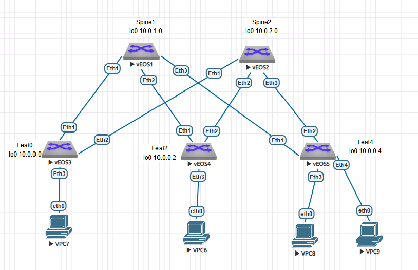

#  Построение Underlay сети(ISIS)
### Топология


###  Цель

  1. Настроить ISIS для Underlay сети
  
  
  
  Условия задания:
  - Настроить ISIS в Underlay сети для IP связнности между всеми сетевыми устройствами.
  - Зафиксировать в документации  план работы, адресное пространство, схему сети, конфигурацию устройств
  - Убедиться в наличии IP связанности между устройствами в ISIS домене
  

#### Часть 1.

Таблица адресации не претерпела изменений с прошлой лабораторной работы, повторяю для удобства. 

 Таблица адресации

|Локация| Устройство     | Интерфейс    | IP-адрес             | Маска подсети|
|:-----------------|:---------------|-------------------------:|:--------------------|-------:|
| DC1  | spine1 | Loopback0   | 10.0.1.0 |255.255.255.255|  
| DC1  | spine1 | Loopback1   | 10.1.1.0 |255.255.255.255|
| DC1  | spine1 | e1   | 10.2.1.1 |255.255.255.254| 
| DC1  | spine1 | e2   | 10.2.1.3 |255.255.255.254| 
| DC1  | spine1 | e3   | 10.2.1.5 |255.255.255.254| 
| DC1  | spine2 | Loopback0   | 10.0.2.0 |255.255.255.255|   
| DC1  | spine2 | Loopback1   | 10.1.2.0 |255.255.255.255|
| DC1  | spine2 | e1   | 10.2.2.1 |255.255.255.254| 
| DC1  | spine2 | e2   | 10.2.2.3 |255.255.255.254| 
| DC1  | spine2 | e3   | 10.2.2.5 |255.255.255.254| 
| DC1  | leaf0 | Loopback0   | 10.0.0.0 |255.255.255.255|   
| DC1  | leaf0 | Loopback1   | 10.1.0.0 |255.255.255.255|
| DC1  | leaf0 | e1   | 10.2.1.0 |255.255.255.254| 
| DC1  | leaf0 | e2   | 10.2.2.0 |255.255.255.254| 
| DC1  | leaf2 | Loopback0   | 10.0.0.2 |255.255.255.255|   
| DC1  | leaf2 | Loopback1   | 10.1.0.2 |255.255.255.255|
| DC1  | leaf2 | e1   | 10.2.1.2 |255.255.255.254| 
| DC1  | leaf2 | e2   | 10.2.2.2 |255.255.255.254|
| DC1  | leaf4 | Loopback0   | 10.0.0.4 |255.255.255.255|   
| DC1  | leaf4 | Loopback1   | 10.1.0.4 |255.255.255.255|
| DC1  | leaf4 | e1   | 10.2.1.4 |255.255.255.254| 
| DC1  | leaf4 | e2   | 10.2.2.4 |255.255.255.254|


#### Часть 2. Настройка ISIS.

Все устройства будут находиться в одной зоне и будут устройствами первого уровня

На всех стыковочных линках будет настроен протокол BFD.

Начну с leaf0

1. Настроила BFD

```
leaf0#conf t
leaf0(config)#int range e1-2
leaf0(config-if-Et1-2)#bfd interval 100 min-rx 100 multiplier 3

```
2. Непосредственная настройка ISIS 

Адрес leaf0  49.0001.0000.1111.0000.00 Он сфомирован следующим образом

49- тип адреса приватный

0001 - номер DC

0000 - зарезервировано 

1111 будет указывать на то, что это leaf (2222 для spine)

0000 - номер устройства

00 - не изменяется


```
leaf0(config)#router isis 1
leaf0(config-router-isis)#net 49.0001.0000.1111.0000.00
leaf0(config-router-isis)#address-family ipv4 unicast
leaf0(config-router-isis)#is-type level-1

```
Интерфейсы, не участвующие в ISIS, перевела в режим passive

```
leaf0(config-router-isis)#passive ethernet 3
leaf0(config-router-isis)#passive lo1

```


3. Настройка интерфейсов

```
leaf0(config-if-Et1-2)#isis network point-to-point
leaf0(config-if-Et1-2)#isis bfd
leaf0(config-if-Et1-2)#isis enable 1
leaf0(config-if-Et1-2)#isis circuit-type  level-1
leaf0(config-if-Et1-2)#exit
leaf0(config)#int lo0
leaf0(config-if-Lo0)#isis enable 1
```


4. Затем настроила ISIS  и BFD на spine1

```
spine1#conf t
spine1(config)#int range e1-3
spine1(config-if-Et1-3)#bfd interval 100 min-rx 100 multiplier 3
spine1(config-if-Et1-3)#ex
spine1(config)#router isis 1
spine1(config-router-isis)#net 49.0001.0000.2222.0001.00
spine1(config-router-isis)#is-type level-1
spine1(config-router-isis)#address-family ipv4 unicast
.
spine1(config)#int range e1-3
spine1(config-if-Et1-3)#isis network point-to-point
spine1(config-if-Et1-3)#isis enable 1
spine1(config-if-Et1-3)#isis bfd
spine1(config-if-Et1-3)#isis circuit-type  level-1
spine1(config-if-Et1-3)#
spine1(config)#int lo0
spine1(config-if-Lo0)#isis ena 1
spine1(config-if-Lo0)#int lo1
spine1(config-if-Lo1)#isis passive
spine1(config-if-Lo1)#


```

5. Между leaf0 и spine1 сформировалось соседство. 

```
spine1#sh isis nei

Instance  VRF      System Id        Type Interface          SNPA              State Hold time   Circuit Id
1         default  leaf0            L1   Ethernet1          P2P               UP    24          0F 

               00:00:37    10.2.1.0        Ethernet1
```

Интерфейсы Loopback0 обоих устройств попали в таблицы маршрутизации друг друга, а  Loopback1 не попали, так как я их пока и не планировала распространять

```
spine1#sh ip route isis

VRF: default
Codes: C - connected, S - static, K - kernel,
       O - OSPF, IA - OSPF inter area, E1 - OSPF external type 1,
       E2 - OSPF external type 2, N1 - OSPF NSSA external type 1,
       N2 - OSPF NSSA external type2, B - Other BGP Routes,
       B I - iBGP, B E - eBGP, R - RIP, I L1 - IS-IS level 1,
       I L2 - IS-IS level 2, O3 - OSPFv3, A B - BGP Aggregate,
       A O - OSPF Summary, NG - Nexthop Group Static Route,
       V - VXLAN Control Service, M - Martian,
       DH - DHCP client installed default route,
       DP - Dynamic Policy Route, L - VRF Leaked,
       G  - gRIBI, RC - Route Cache Route

 I L1     10.0.0.0/32 [115/20] via 10.2.1.0, Ethernet1
 I L1     10.2.2.0/31 [115/20] via 10.2.1.0, Ethernet1

```


6. Далее настроила leaf2,leaf4, spine2.

7. Все устройства установили необходимые соседства , все Lo0 отображены в таблице маршрутизации каждого устройства
(на примере leaf0)

```
leaf0#sh isis data

IS-IS Instance: 1 VRF: default
  IS-IS Level 1 Link State Database
    LSPID                   Seq Num  Cksum  Life Length IS Flags
    leaf0.00-00                 128  63058  1193     97 L1 <>
    leaf2.00-00                 111  22054  1139    121 L1 <>
    leaf4.00-00                 105  17452  1142    121 L1 <>
    spine1.00-00                153  54412  1138    146 L1 <>
    spine2.00-00                152  18192  1142    146 L1 <>
```

```
leaf0#sh ip route


Gateway of last resort is not set

 C        10.0.0.0/32 is directly connected, Loopback0
 I L1     10.0.0.2/32 [115/30] via 10.2.1.1, Ethernet1
                               via 10.2.2.1, Ethernet2
 I L1     10.0.0.4/32 [115/30] via 10.2.1.1, Ethernet1
                               via 10.2.2.1, Ethernet2
 I L1     10.0.1.0/32 [115/20] via 10.2.1.1, Ethernet1
 I L1     10.0.2.0/32 [115/20] via 10.2.2.1, Ethernet2
 C        10.1.0.0/32 is directly connected, Loopback1
 C        10.2.1.0/31 is directly connected, Ethernet1
 I L1     10.2.1.2/31 [115/20] via 10.2.1.1, Ethernet1
 I L1     10.2.1.4/31 [115/20] via 10.2.1.1, Ethernet1
 C        10.2.2.0/31 is directly connected, Ethernet2
 I L1     10.2.2.2/31 [115/20] via 10.2.2.1, Ethernet2
 I L1     10.2.2.4/31 [115/20] via 10.2.2.1, Ethernet2

leaf0#

```


#### Часть 3. Проверка IP связанности между устройствами в ISIS домене.

Leaf0, leaf2, leaf4 пингуют друг друга

leaf0-leaf4
```
leaf0#ping 10.0.0.4

PING 10.0.0.4 (10.0.0.4) 72(100) bytes of data.
80 bytes from 10.0.0.4: icmp_seq=1 ttl=63 time=37.8 ms
80 bytes from 10.0.0.4: icmp_seq=2 ttl=63 time=37.3 ms
80 bytes from 10.0.0.4: icmp_seq=3 ttl=63 time=37.2 ms
80 bytes from 10.0.0.4: icmp_seq=4 ttl=63 time=28.6 ms
80 bytes from 10.0.0.4: icmp_seq=5 ttl=63 time=35.9 ms

```
leaf0-leaf2
```
leaf2#ping 10.0.0.0
PING 10.0.0.0 (10.0.0.0) 72(100) bytes of data.
80 bytes from 10.0.0.0: icmp_seq=1 ttl=63 time=111 ms
80 bytes from 10.0.0.0: icmp_seq=2 ttl=63 time=133 ms
80 bytes from 10.0.0.0: icmp_seq=3 ttl=63 time=136 ms
80 bytes from 10.0.0.0: icmp_seq=4 ttl=63 time=141 ms
80 bytes from 10.0.0.0: icmp_seq=5 ttl=63 time=143 ms


```
leaf2-leaf4
```
leaf2#ping 10.0.0.4
PING 10.0.0.4 (10.0.0.4) 72(100) bytes of data.
80 bytes from 10.0.0.4: icmp_seq=1 ttl=63 time=60.8 ms
80 bytes from 10.0.0.4: icmp_seq=2 ttl=63 time=56.8 ms
80 bytes from 10.0.0.4: icmp_seq=3 ttl=63 time=142 ms
80 bytes from 10.0.0.4: icmp_seq=4 ttl=63 time=149 ms
80 bytes from 10.0.0.4: icmp_seq=5 ttl=63 time=144 ms


```
Файлы конфигурации можно посмотреть [здесь](configs/).
###  The End 