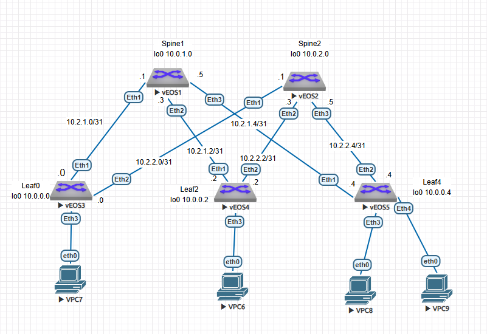

#  Построение Underlay сети(iBGP)
### Топология


###  Цель

  1. Настроить iBGP для Underlay сети
  
  
  
  Условия задания:
  - Настроить iBGP в Underlay сети для IP связнности между всеми сетевыми устройствами.
  - Зафиксировать в документации  план работы, адресное пространство, схему сети, конфигурацию устройств
  - Убедиться в наличии IP связанности между устройствами в ISIS домене
  

#### Часть 1.

Таблица адресации не претерпела изменений с прошлой лабораторной работы, повторяю для удобства. 

Также я дополнительно отобразила на схеме линковочные сети.

 Таблица адресации

|Локация| Устройство     | Интерфейс    | IP-адрес             | Маска подсети|
|:-----------------|:---------------|-------------------------:|:--------------------|-------:|
| DC1  | spine1 | Loopback0   | 10.0.1.0 |255.255.255.255|  
| DC1  | spine1 | Loopback1   | 10.1.1.0 |255.255.255.255|
| DC1  | spine1 | e1   | 10.2.1.1 |255.255.255.254| 
| DC1  | spine1 | e2   | 10.2.1.3 |255.255.255.254| 
| DC1  | spine1 | e3   | 10.2.1.5 |255.255.255.254| 
| DC1  | spine2 | Loopback0   | 10.0.2.0 |255.255.255.255|   
| DC1  | spine2 | Loopback1   | 10.1.2.0 |255.255.255.255|
| DC1  | spine2 | e1   | 10.2.2.1 |255.255.255.254| 
| DC1  | spine2 | e2   | 10.2.2.3 |255.255.255.254| 
| DC1  | spine2 | e3   | 10.2.2.5 |255.255.255.254| 
| DC1  | leaf0 | Loopback0   | 10.0.0.0 |255.255.255.255|   
| DC1  | leaf0 | Loopback1   | 10.1.0.0 |255.255.255.255|
| DC1  | leaf0 | e1   | 10.2.1.0 |255.255.255.254| 
| DC1  | leaf0 | e2   | 10.2.2.0 |255.255.255.254| 
| DC1  | leaf2 | Loopback0   | 10.0.0.2 |255.255.255.255|   
| DC1  | leaf2 | Loopback1   | 10.1.0.2 |255.255.255.255|
| DC1  | leaf2 | e1   | 10.2.1.2 |255.255.255.254| 
| DC1  | leaf2 | e2   | 10.2.2.2 |255.255.255.254|
| DC1  | leaf4 | Loopback0   | 10.0.0.4 |255.255.255.255|   
| DC1  | leaf4 | Loopback1   | 10.1.0.4 |255.255.255.255|
| DC1  | leaf4 | e1   | 10.2.1.4 |255.255.255.254| 
| DC1  | leaf4 | e2   | 10.2.2.4 |255.255.255.254|


#### Часть 2. Настройка iBGP.

Я буду придерживаться рекомендуемой схемы: все spine будут настроены как Route reflector а все 
leaf будут клиентами. leaf и spine будут анонсировать  только Loopback0.

Номер AS выбрала из диапазона для приватныъ AS (64512-65534)/ Номер AS для DC1 будет 65001

На всех линках настроен BFD

Таймеры iBGP: keepalive , hold  уменьшила

Включила multipath для резервирования и рациональной утилизации линков

Настройка iBGP на spine1

```
router bgp 65001
   router-id 10.0.1.0
   neighbor AS65001 peer group
   neighbor AS65001 remote-as 65001
   neighbor AS65001 next-hop-self
   neighbor AS65001 bfd
   neighbor AS65001 route-reflector-client
   neighbor AS65001 timers 3 9
   neighbor 10.2.1.0 peer group AS65001
   neighbor 10.2.1.2 peer group AS65001
   neighbor 10.2.1.4 peer group AS65001
   network 10.0.2.0/32
!
```

Настройка iBGP на spine2

```
router bgp 65001
   timers bgp 3 9
   neighbor AS65001 peer group
   neighbor AS65001 remote-as 65001
   neighbor AS65001 next-hop-self
   neighbor AS65001 bfd
   neighbor AS65001 route-reflector-client
   neighbor 10.2.2.0 peer group AS65001
   neighbor 10.2.2.2 peer group AS65001
   neighbor 10.2.2.4 peer group AS65001
   network 10.0.2.0/32

```

Настройка iBGP на leaf0

```
router bgp 65001
   router-id 10.0.0.0
   timers bgp 3 9
   maximum-paths 64
   neighbor 10.2.1.1 remote-as 65001
   neighbor 10.2.1.1 next-hop-self
   neighbor 10.2.1.1 bfd
   neighbor 10.2.2.1 remote-as 65001
   neighbor 10.2.2.1 next-hop-self
   neighbor 10.2.2.1 bfd
   network 10.0.0.0/32
!
``` 
Настройка iBGP на leaf2

```
router bgp 65001
   router-id 10.0.0.2
   timers bgp 3 9
   maximum-paths 64
   neighbor 10.2.1.3 remote-as 65001
   neighbor 10.2.1.3 next-hop-self
   neighbor 10.2.1.3 bfd
   neighbor 10.2.2.3 remote-as 65001
   neighbor 10.2.2.3 next-hop-self
   neighbor 10.2.2.3 bfd
   network 10.0.0.2/32
!
```
Настройка iBGP на leaf4

```
router bgp 65001
   router-id 10.0.0.4
   timers bgp 3 9
   maximum-paths 64
   neighbor 10.2.1.5 remote-as 65001
   neighbor 10.2.1.5 next-hop-self
   neighbor 10.2.1.5 bfd
   neighbor 10.2.2.5 remote-as 65001
   neighbor 10.2.2.5 next-hop-self
   neighbor 10.2.2.5 bfd
   network 10.0.0.4/32
!
```
Все соседства сформировались корректно

на spine1

```
spine1#sh ip bgp summ
BGP summary information for VRF default
Router identifier 10.0.1.0, local AS number 65001
Neighbor Status Codes: m - Under maintenance
  Neighbor         V  AS           MsgRcvd   MsgSent  InQ OutQ  Up/Down State   PfxRcd PfxAcc
  10.2.1.0         4  65001           2014      2125    0    0 00:00:55 Estab   1      1
  10.2.1.2         4  65001           1836      1960    0    0 00:00:57 Estab   1      1
  10.2.1.4         4  65001           1737      1845    0    0 00:00:55 Estab   1      1

```


на spine2

```
spine2#sh ip bgp summ
BGP summary information for VRF default
Router identifier 10.1.2.0, local AS number 65001
Neighbor Status Codes: m - Under maintenance
  Neighbor         V  AS           MsgRcvd   MsgSent  InQ OutQ  Up/Down State   PfxRcd PfxAcc
  10.2.2.0         4  65001          28103     28271    0    0 00:00:35 Estab   1      1
  10.2.2.2         4  65001          27608     27796    0    0 00:00:35 Estab   1      1
  10.2.2.4         4  65001          27530     27689    0    0 00:00:35 Estab   1      1

```

На примере leaf0 видно, что таблица маршрутизации сформировалась 
с альтарнативными маршрутами, как и требовалось

```
leaf0#sh ip route


Gateway of last resort is not set

 C        10.0.0.0/32 is directly connected, Loopback0
 B I      10.0.0.2/32 [200/0] via 10.2.1.1, Ethernet1
                              via 10.2.2.1, Ethernet2
 B I      10.0.0.4/32 [200/0] via 10.2.1.1, Ethernet1
                              via 10.2.2.1, Ethernet2
 B I      10.0.2.0/32 [200/0] via 10.2.2.1, Ethernet2
 C        10.1.0.0/32 is directly connected, Loopback1
 C        10.2.1.0/31 is directly connected, Ethernet1
 C        10.2.2.0/31 is directly connected, Ethernet2

```


#### Часть 3. Проверка IP связанности между устройствами.

Leaf0, leaf2, leaf4 пингуют друг друга

leaf0-leaf4
```
leaf0#ping 10.0.0.4 source 10.0.0.0
PING 10.0.0.4 (10.0.0.4) from 10.0.0.0 : 72(100) bytes of data.
80 bytes from 10.0.0.4: icmp_seq=1 ttl=63 time=87.0 ms
80 bytes from 10.0.0.4: icmp_seq=2 ttl=63 time=84.3 ms
80 bytes from 10.0.0.4: icmp_seq=3 ttl=63 time=86.4 ms
80 bytes from 10.0.0.4: icmp_seq=4 ttl=63 time=86.4 ms
80 bytes from 10.0.0.4: icmp_seq=5 ttl=63 time=84.3 ms

```
leaf0-leaf2
```
leaf2#ping 10.0.0.0 source 10.0.0.2
PING 10.0.0.0 (10.0.0.0) from 10.0.0.2 : 72(100) bytes of data.
80 bytes from 10.0.0.0: icmp_seq=1 ttl=63 time=48.4 ms
80 bytes from 10.0.0.0: icmp_seq=2 ttl=63 time=43.7 ms
80 bytes from 10.0.0.0: icmp_seq=3 ttl=63 time=48.9 ms
80 bytes from 10.0.0.0: icmp_seq=4 ttl=63 time=46.3 ms
80 bytes from 10.0.0.0: icmp_seq=5 ttl=63 time=77.7 ms

```
leaf2-leaf4
```
leaf4#ping 10.0.0.2 source 10.0.0.4
PING 10.0.0.2 (10.0.0.2) from 10.0.0.4 : 72(100) bytes of data.
80 bytes from 10.0.0.2: icmp_seq=1 ttl=63 time=133 ms
80 bytes from 10.0.0.2: icmp_seq=2 ttl=63 time=134 ms
80 bytes from 10.0.0.2: icmp_seq=3 ttl=63 time=147 ms
80 bytes from 10.0.0.2: icmp_seq=4 ttl=63 time=144 ms
80 bytes from 10.0.0.2: icmp_seq=5 ttl=63 time=148 ms

```
Файлы конфигурации можно посмотреть [здесь](configs/).
###  The End 